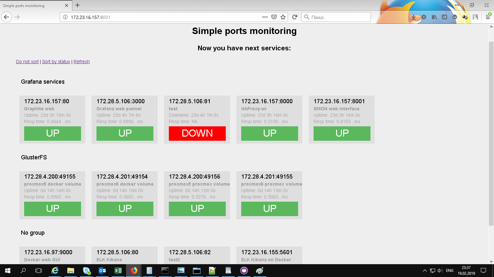

# smon
Simple monitoring TCP ports with alerting via Telegram and WEB pannel

# Use

```
# smonctl -h
usage: smonctl [-h] {list,add,del,edit,enable,disable} ...

Simple service for monitoring TCP ports

positional arguments:
  {list,add,del,edit,enable,disable}
    list                List of services
    add                 Add new service to monitoring
    del                 Delete service from monitoring
    edit                Edit service
    enable              Enable service monitoring
    disable             Disable service monitoring

optional arguments:
  -h, --help            show this help message and exit
```


# Run script

If you want to run the scripts when any service start "Down", you can use --script option, and script will be execute:
```
smonctl add 172.23.16.157 80 --script "/root/test" --desc "Some service" --group "Some group"
```

# Install

Just copy repository to /opt/smon and execute next commands:

```
cd /opt/smon
sudo chmod +x *.py
pip3 install -r requirements.txt
sudo ./sql.py
sudo mv smon.service /etc/systemd/system
sudo systemctl daemon-reload
sudo systemctl enable smon
sudo systemctl start smon
```

# Settings

Edit /opt/smon/smon.cfg with your env

# Install WEB

```
mv www/smon.conf /etc/httpd/conf.d
mv www/smon /var/www/
systemctl reload httpd
```

And edit /etc/httpd/conf/httpd.conf to:
```
DirectoryIndex index.html index.py
```
